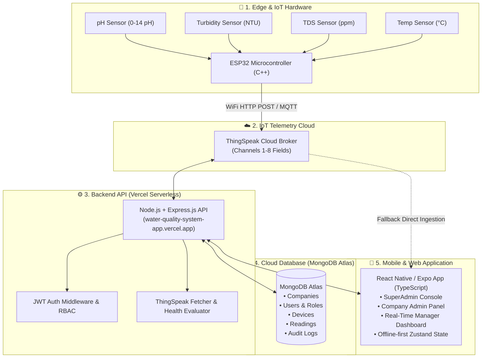
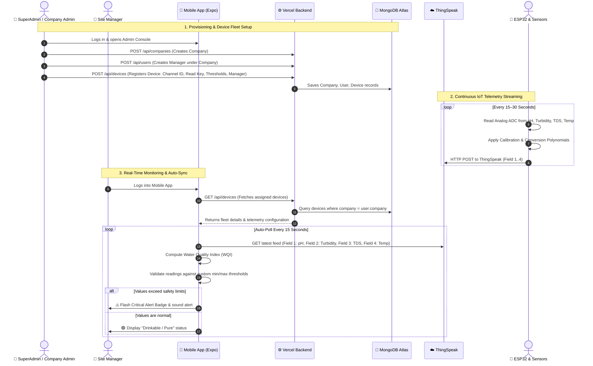

# Enterprise Water Quality Monitoring System
## Complete System Architecture, Technology Stack, IoT Hardware & Operational Workflow Specification

---

## 1. Executive Summary & Overview

The **Enterprise Water Quality Monitoring System** is an end-to-end, multi-tenant IoT and cloud platform engineered for real-time telemetry, automated water safety scoring, threshold violation alerting, and fleet device management.

The solution enables municipalities, beverage plants, agricultural facilities, and industrial complexes to continuously monitor critical water parameters (pH, Turbidity, Total Dissolved Solids, Temperature) and compute a real-time **Water Quality Index (WQI)**.



---

## 2. Technology Stack & Programming Languages

| Layer | Language / Technology | Version / Tooling | Purpose & Responsibilities |
| :--- | :--- | :--- | :--- |
| **Mobile Frontend** | **TypeScript** | 5.9+ | Static typing, maintainable contracts, zero runtime type errors. |
| | **React Native / Expo** | Expo SDK 54 / RN 0.81 | Cross-platform mobile application (Android APK & iOS) and Web UI. |
| | **Expo Router** | v6 (File-based) | Native screen navigation, nested tab bar layouts, route guards. |
| | **Zustand** | 5.0+ | Fast, persistent state management for auth tokens, tenant context, and fleet cache. |
| | **Victory Native / SVG** | 41.2+ / 15.15+ | Interactive time-series visual charts for real-time sensor metrics. |
| | **Axios** | 1.16+ | HTTP client with automatic Bearer token injection, auto-reconnect, and 401 interceptors. |
| **Backend API** | **JavaScript (ES6+)** | Node.js 20+ | Asynchronous, event-driven REST API server. |
| | **Express.js** | 4.21+ | Middleware pipeline, REST route handlers, controller orchestration. |
| | **Vercel Serverless** | Latest | 24/7 high-availability serverless deployment with automated CI/CD. |
| | **JWT (jsonwebtoken)** | 9.0+ | Stateless access and refresh tokens for secure session validation. |
| | **bcryptjs** | 2.4+ | Salted password hashing for enterprise account security. |
| **Database & ORM** | **MongoDB Atlas** | 7.0+ (Cloud M0/M10) | Multi-tenant NoSQL document storage with horizontal replica set redundancy. |
| | **Mongoose** | 8.8+ | Strict ODM data schemas, compound indexes, model hooks, and query population. |
| **IoT / Hardware** | **C / C++** | Arduino IDE / ESP-IDF | Embedded firmware running on the ESP32 microcontroller. |
| | **ThingSpeak REST** | HTTP / HTTPS | Cloud telemetry message broker for streaming field readings. |

---

## 3. IoT Hardware & Sensor Specifications

### 3.1 Hardware Components
1. **Microcontroller**: **ESP32 DevKit V1** (32-bit dual-core Tensilica Xtensa 240MHz, integrated 2.4GHz 802.11 b/g/n Wi-Fi and Bluetooth LE).
2. **pH Sensor (Analog)**:
   - Measures hydrogen-ion activity ($0.0 - 14.0\text{ pH}$).
   - Operating Voltage: $5.0\text{ V}$.
   - Ideal Drinking Range: $6.5 - 8.5\text{ pH}$.
3. **Turbidity Sensor (TS-300B / Optical)**:
   - Measures water clarity and light scattering from suspended particulates.
   - Output Unit: **NTU** (Nephelometric Turbidity Units).
   - Ideal Potable Range: $< 1.0\text{ NTU}$ (Acceptable: $< 5.0\text{ NTU}$).
4. **Total Dissolved Solids (TDS) Sensor**:
   - Measures electrical conductivity to estimate dissolved minerals, salts, and metals.
   - Output Unit: **ppm** (parts per million) or $\text{mg/L}$.
   - Ideal Drinking Range: $50 - 300\text{ ppm}$ (Maximum limit: $500\text{ ppm}$).
5. **Temperature Sensor (DS18B20 Waterproof)**:
   - 1-Wire digital temperature probe with stainless steel waterproof casing.
   - Operating Range: $-55\text{ °C}$ to $+125\text{ °C}$.
   - Typical Water Range: $10 - 25\text{ °C}$.

### 3.2 Telemetry Channel Mapping (ThingSpeak)
| Field | Parameter | Unit | Safe Min | Safe Max | Critical Level |
| :--- | :--- | :--- | :--- | :--- | :--- |
| **Field 1** | pH Level | pH | 6.5 | 8.5 | < 4.0 or > 10.0 |
| **Field 2** | Turbidity | NTU | 0.0 | 5.0 | > 10.0 NTU |
| **Field 3** | Total Dissolved Solids | ppm | 0 | 500 | > 1000 ppm |
| **Field 4** | Water Temperature | °C | 10.0 | 25.0 | > 35.0 °C |

---

## 4. Database Models & Schema Design (MongoDB Atlas)

### 4.1 Company (`Company.js`)
Represents an isolated tenant organization (e.g., `"Metro Water Utilities"`, `"AquaPure Plant 2"`).
- `name` (String, required, unique)
- `subscriptionPlan` (String: `Basic`, `Professional`, `Enterprise`)
- `isActive` (Boolean, default `true`)
- `address` & `contactEmail`
- `managerLimit` (Number: maximum allowed managers for this company)

### 4.2 User (`User.js`)
Represents user credentials and permissions.
- `name` (String, required)
- `email` (String, required, unique, lowercase)
- `passwordHash` (String, bcrypt salted hash)
- `role` (ObjectId -> references `Role` model)
- `company` (ObjectId -> references `Company` model, null for SuperAdmin)
- `isActive` (Boolean, default `true`)
- `refreshTokenHash` & `refreshTokenExpiresAt`

### 4.3 Device (`Device.js`)
Represents physical hardware nodes bound to a tenant.
- `deviceId` (String, e.g. `"WQ-RES-01"`)
- `name` (String, e.g. `"Main Reservoir Monitor"`)
- `company` (ObjectId -> references `Company`, required)
- `assignedManager` (ObjectId -> references `User`, default null)
- `channelId` (String, ThingSpeak Channel ID)
- `readKey` (String, ThingSpeak Read API Key - private)
- `writeKey` (String, ThingSpeak Write API Key - private)
- `location` (String, e.g. `"Building 3 Water Inflow"`)
- `fieldMappings` (Array of objects defining parameter, unit, and custom min/max thresholds)
- `offlineThresholdMinutes` (Number, default 30 min)
- `status` (`Online`, `Offline`, `Warning`, `No Recent Data`)
- `lastDataReceived` (Date)

### 4.4 WaterQualityReading (`WaterQualityReading.js`)
Stores long-term historical timeseries telemetry.
- `company` (ObjectId -> references `Company`)
- `timestamp` (Date, indexed)
- `pH`, `turbidity`, `dissolvedOxygen`, `temperature` (Numbers)
- `location` (GeoJSON 2dsphere point coordinates)
- `createdBy` (ObjectId -> references `User` or System)

### 4.5 AuditLog (`AuditLog.js`)
Immutable audit trail recording administrative actions.
- `actor` (ObjectId -> User who performed action)
- `action` (String, e.g. `DEVICE_CREATED`, `THRESHOLD_UPDATED`, `USER_SUSPENDED`)
- `targetResource` (String)
- `metadata` (JSON Object)
- `timestamp` (Date)

---

## 5. Role Hierarchy & User Access Matrix

```
       👑 SuperAdmin (Global Platform Owner)
                     │
       ┌─────────────┴─────────────┐
       ▼                           ▼
🏢 Company Admin (Tenant A)   🏢 Company Admin (Tenant B)
       │                           │
       ▼                           ▼
👷 Site Manager / Operator    👷 Site Manager / Operator
```

| Operational Capability | 👑 SuperAdmin | 🏢 Company Admin | 👷 Site Manager / Operator |
| :--- | :---: | :---: | :---: |
| **System Overview & Multi-Tenant Switcher** | ✅ All Companies | ❌ Own Company only | ❌ Assigned Devices only |
| **Create / Delete Organizations** | ✅ Full Access | ❌ No Access | ❌ No Access |
| **Provision Company Admins** | ✅ Full Access | ❌ No Access | ❌ No Access |
| **Provision Managers & Field Staff** | ✅ Full Access | ✅ For own company | ❌ No Access |
| **Register & Provision IoT Devices** | ✅ Full Access | ✅ For own company | ❌ View Only |
| **Configure ThingSpeak Channels & Keys** | ✅ Full Access | ✅ For own company | ❌ View Only |
| **Configure Sensor Min / Max Thresholds** | ✅ Full Access | ✅ For own company | ❌ View Only |
| **Live Telemetry & Real-Time Dashboard** | ✅ Any Company | ✅ Own Company | ✅ Assigned Devices |
| **View Historical Charts & Trends** | ✅ Full Access | ✅ Own Company | ✅ Assigned Devices |
| **Receive Real-Time Safety Alerts** | ✅ System-wide | ✅ Company-wide | ✅ Assigned Device Alerts |

---

## 6. End-to-End Operational Workflow



### 6.1 Water Quality Index (WQI) Calculation Formula
The application calculates a weighted index based on the four key parameters:
$$WQI = \sum_{i=1}^{n} (w_i \times q_i)$$
Where:
- $q_i$ is the parameter quality rating ($0 - 100$) based on deviation from ideal standard.
- $w_i$ is the unit weight assigned to each parameter ($w_{\text{pH}} = 0.35$, $w_{\text{Turbidity}} = 0.25$, $w_{\text{TDS}} = 0.25$, $w_{\text{Temp}} = 0.15$).

**Classification Scale:**
- **90 – 100**: 🟢 **Excellent** (Safe for Direct Consumption / Potable)
- **70 – 89**: 🔵 **Good** (Minor mineral variance, safe)
- **50 – 69**: 🟡 **Fair** (Requires standard filtration / chlorination)
- **< 50**: 🔴 **Poor / Hazardous** (Industrial / Unsafe for drinking)

---

## 7. REST API Endpoint Directory

### Authentication (`/api/auth`)
- `POST /api/auth/login`: Authenticate with email and password; returns access token (15m) + refresh token (7d) + user profile.
- `POST /api/auth/refresh`: Exchange valid refresh token for a new access token.
- `POST /api/auth/logout`: Revoke active refresh token.
- `GET /api/auth/me`: Get active session information and company privileges.

### Organization Management (`/api/companies`)
- `GET /api/companies`: List all tenant organizations (SuperAdmin only).
- `POST /api/companies`: Create new enterprise company with owner credentials.
- `PUT /api/companies/:id`: Update company details, manager limits, or status.
- `DELETE /api/companies/:id`: Suspend or delete company tenant.

### User Management (`/api/users`)
- `GET /api/users`: List users filtered by company and role.
- `POST /api/users`: Provision a new Company Admin or Site Manager.
- `PUT /api/users/:id`: Modify user status (active/suspended) or role.

### IoT Device Fleet (`/api/devices`)
- `GET /api/devices`: List all devices for the authenticated tenant.
- `POST /api/devices`: Register new IoT device with ThingSpeak Channel ID, API keys, and parameter thresholds.
- `PUT /api/devices/:id`: Update device metadata, thresholds, or assigned manager.
- `DELETE /api/devices/:id`: Decommission device from fleet.
- `POST /api/devices/test-connection`: Ping ThingSpeak API with credentials to verify channel connectivity.

### Telemetry & Ingestion (`/api/iotData` & `/api/water`)
- `GET /api/iotData/:deviceId/latest`: Get latest real-time reading from device.
- `GET /api/iotData/:deviceId/history`: Get historical parameter trends (last 24h, 7d, 30d).
- `POST /api/water/readings`: Manual or automated ingestion of batch water quality readings.

---

## 8. Deployment, Production & Mobile APK Distribution

1. **Cloud API (Vercel)**:
   - Hosted at: `https://water-quality-system-app.vercel.app`
   - Serverless Node.js backend configured via `vercel.json`.
   - On-demand MongoDB Mongoose connection pooling (`requireMongo.js`).

2. **Cloud Database (MongoDB Atlas)**:
   - Dedicated cloud cluster with automatic failover.
   - Network access configured for cloud API traffic (`0.0.0.0/0` with user authentication).

3. **Android APK Build (Expo Application Services - EAS)**:
   - Pre-configured `mobile/eas.json` with `"buildType": "apk"`.
   - Bundles production backend URL (`https://water-quality-system-app.vercel.app`).
   - Generates standalone, installable `.apk` file directly runnable on Android devices without requiring Metro or local development servers.
