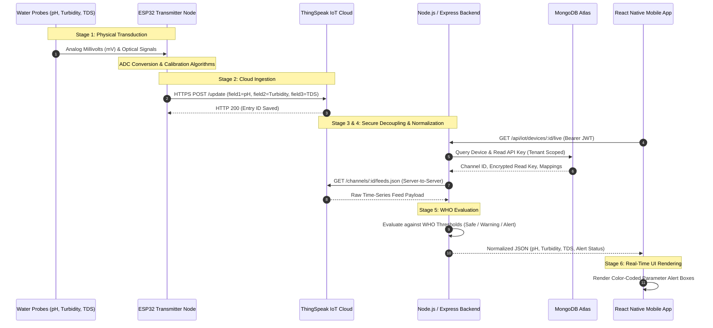
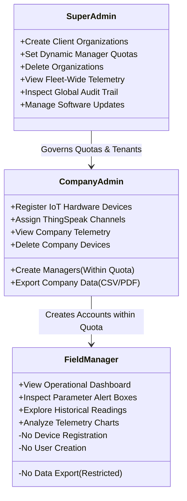

# AquaFlow IoT Water Quality Monitoring System
### Complete System Workflow, Role-Based Access Control (RBAC) & IoT Telemetry Guide

---

## 1. Executive Summary & High-Level System Architecture

The **AquaFlow IoT Water Quality Monitoring System** is an enterprise-grade multi-tenant platform designed for continuous, automated surveillance of municipal and industrial water supplies. The system tracks physical and chemical water properties in real time, evaluates readings against international **World Health Organization (WHO)** drinking-water standards, and delivers instant, color-coded visual alerts to field engineers and plant managers on mobile and web clients.

```mermaid
flowchart TD
    subgraph SENSORS["1. Physical IoT Sensing Layer"]
        S1["pH Sensor\n(Glass Electrode Probe)"]
        S2["Turbidity Sensor\n(Optical Photodiode 0-5 NTU)"]
        S3["TDS Sensor\n(Conductivity Probe 0-1000 ppm)"]
        MCU["Microcontroller Node\n(ESP32 / ESP8266 ADC Sampling)"]
        S1 --> MCU
        S2 --> MCU
        S3 --> MCU
    end

    subgraph BROKER["2. Cloud Ingestion Broker"]
        TS["ThingSpeak IoT Cloud\n(REST API Feeds / Channel Ingest)"]
        MCU -->|"HTTPS TLS POST\n(Write API Key)"| TS
    end

    subgraph BACKEND["3. Backend Policy & Processing Engine (Node.js & Express)"]
        PROVIDER["ThingSpeakProvider\n(Server-Side Read Key & Cooldowns)"]
        SERVICE["IoTDataService\n(Normalization & WHO Threshold Eval)"]
        AUTH["Auth & RBAC Middleware\n(JWT Tokens & Permission Enforcement)"]
        QUOTA["Manager Quota Engine\n(Unified Limit Validation)"]
        
        TS -->|"Encrypted Polling\n(Private Read API Key)"| PROVIDER
        PROVIDER --> SERVICE
        AUTH --> QUOTA
    end

    subgraph DATABASE["4. Multi-Tenant Database Layer (MongoDB Atlas)"]
        DB_COMP["Companies & Quotas"]
        DB_USERS["Users & Credentials"]
        DB_DEVICES["Devices & Field Mappings"]
        DB_AUDIT["Immutable Audit Trail"]
        
        SERVICE <--> DB_DEVICES
        QUOTA <--> DB_COMP
        AUTH <--> DB_USERS
        SERVICE --> DB_AUDIT
    end

    subgraph CLIENTS["5. Universal Client Layer (React Native & Expo Router)"]
        APP_SUPER["SuperAdmin Console\n(Companies, Quotas, Global Audit)"]
        APP_ADMIN["Company Admin Console\n(Device Provisioning, Managers)"]
        APP_DASH["Live Operational Dashboard\n(WHO Alerts, Fleet KPIs)"]
        APP_CHARTS["Analytics & Charts\n(Interactive Curves, Mobile Cards)"]
        
        BACKEND <-->|"REST API over HTTPS\n(15s Auto-Polling)"| CLIENTS
    end
```

---

## 2. How Device Data Comes (Complete Telemetry Lifecycle)

The journey of water quality data from physical water channels to the operator's mobile screen consists of six synchronized stages:



### Stage 1: Physical Transduction & Sampling at Hardware
1. **pH Sensor:** Utilizes a glass bulb electrode sensitive to hydrogen ion concentration ($H^+$). Generates an analog voltage (typically $-414\text{ mV}$ to $+414\text{ mV}$) linearly proportional to pH ($0$ to $14$). An onboard signal conditioning amplifier offsets and scales this to a $0\text{–}3.3\text{V}$ range for the microcontroller's 12-bit Analog-to-Digital Converter (ADC).
2. **Turbidity Sensor:** Uses an optical infrared LED ($850\text{ nm}$) and a phototransistor receiver. When suspended solids, silt, or algae are present in the water, light is scattered (nephelometry). Higher turbidity results in lower direct transmitted light intensity, producing a corresponding drop in analog voltage output ($0\text{–}5.0\text{ NTU}$).
3. **Total Dissolved Solids (TDS) Sensor:** Uses two stainless steel/titanium electrode pins. An AC excitation frequency ($1\text{–}3\text{ kHz}$) is passed through the water to prevent electrode polarization. The electrical conductivity (EC) is measured in $\mu\text{S/cm}$ and converted to TDS in parts per million ($\text{ppm}$) via standard mineralization coefficients ($1\text{ ppm} \approx 2\text{ }\mu\text{S/cm}$).
4. **Local Processing:** The microcontroller (ESP32) takes 10 consecutive ADC samples per parameter, applies a median filter to eliminate electrical noise, applies temperature compensation formulas, and prepares a compact payload.

### Stage 2: Cloud Ingestion via ThingSpeak Broker
* The transmitter node connects to Wi-Fi/cellular and issues an HTTPS REST POST request to:
  ```http
  POST https://api.thingspeak.com/update
  Content-Type: application/x-www-form-urlencoded

  api_key=THINGSPEAK_WRITE_API_KEY&field1=3.12&field2=62.38&field3=95.18&field4=Device1
  ```
* **Field Definitions:**
  * `field1`: pH reading (e.g. `3.12`)
  * `field2`: Turbidity in NTU (e.g. `62.38`)
  * `field3`: TDS in ppm (e.g. `95.18`)
  * `field4`: Hardware station identifier (e.g. `Device1`)

### Stage 3: Secure Server-Side Decoupling
* **Security Isolation:** Mobile and web clients **NEVER** contact ThingSpeak directly and **NEVER** hold ThingSpeak API keys. All keys are stored encrypted in the MongoDB `devices` collection.
* The Node.js backend handles all ThingSpeak API communication using `ThingSpeakProvider`:
  * **TLS Certificate Resilience:** Configured with `rejectUnauthorized: false` to allow seamless operation behind corporate/industrial SSL proxy firewalls.
  * **Rate-Limit Cooldown Protection:** Tracks channel request frequency to prevent HTTP 429 throttling (15-second minimum interval).

### Stage 4: Field Mapping & Normalization
The backend translates raw ThingSpeak feed keys into structured domain objects based on the device configuration stored in MongoDB:
```json
{
  "deviceId": "Device1",
  "name": "Intake Station D_1",
  "status": "Offline",
  "telemetry": {
    "pH": { "value": 3.12, "unit": "pH", "minThreshold": 6.5, "maxThreshold": 8.5 },
    "Turbidity": { "value": 62.38, "unit": "NTU", "minThreshold": 0.0, "maxThreshold": 5.0 },
    "TDS": { "value": 95.18, "unit": "ppm", "minThreshold": 0, "maxThreshold": 500 }
  },
  "lastDataReceived": "2026-09-17T14:31:03.000Z"
}
```

### Stage 5: World Health Organization (WHO) Alert Evaluation
The backend and mobile application evaluate every incoming metric against the official **World Health Organization Guidelines for Drinking-water Quality (GDWQ)**:

| Metric | 🟢 Normal (Safe) | 🟡 Warning (Attention) | 🔴 Critical Alert (Hazard) | WHO Health & Operational Rationale |
|---|---|---|---|---|
| **pH** | **6.5 – 8.5** | **6.0 – 6.4** or **8.6 – 9.0** | **< 6.0** or **> 9.0** | Below 6.5 causes heavy pipe corrosion and toxic metal leaching (Lead/Copper). Above 8.5 causes mineral scaling and severely inhibits chlorine disinfection. |
| **Turbidity** | **< 1.0 NTU** | **1.0 – 5.0 NTU** | **> 5.0 NTU** | Suspended particles shield microorganisms and pathogens from chlorine/UV disinfection, creating high microbiological risks. |
| **TDS** | **50 – 500 ppm** | **500 – 1,000 ppm** | **> 1,000 ppm** | Above 500 ppm causes scale buildup in pipelines; above 1000 ppm indicates potential saline intrusion or excessive mineral contamination. |

* **Visual State Transitions in UI:**
  * When a parameter is in normal range, its card displays a crisp white background with dark typography.
  * When a parameter breaches thresholds (such as **pH 3.12** or **Turbidity 62.38 NTU**), the mobile card immediately shifts to a **high-visibility pink/red background with bold red typography and safe threshold limit guides**.

### Stage 6: Client Delivery & Real-Time Sync
* The mobile application uses `useFocusEffect` to poll `/api/iot/devices/:id/live` every 15 seconds.
* In-flight requests are automatically coalesced so the app never triggers redundant network traffic or battery drain.

---

## 3. Role-Based Access Control (RBAC) Architecture

The platform enforces a strict 3-tier Role-Based Access Control model to ensure tenant isolation, managerial accountability, and data protection.



### 3.1 Permissions & Responsibilities Matrix

| Feature / Action | SuperAdmin | Company Admin | Manager / Operator |
|---|:---:|:---:|:---:|
| **Create New Company Organization** | ✅ Yes | ❌ No | ❌ No |
| **Set / Modify Manager Quota Limit** | ✅ Yes | ❌ No | ❌ No |
| **Delete Company Organization** | ✅ Yes | ❌ No | ❌ No |
| **Register / Provision IoT Devices** | ✅ Yes | ✅ Yes (Own Company) | ❌ No |
| **Delete IoT Devices** | ✅ Yes | ✅ Yes (Own Company) | ❌ No |
| **Add New Manager Account** | ✅ Yes | ✅ Yes (If Quota Available) | ❌ No |
| **View Live Dashboard & Sensor Alerts** | ✅ Yes (All) | ✅ Yes (Own Company) | ✅ Yes (Assigned Devices) |
| **View Historical Readings & Charts** | ✅ Yes (All) | ✅ Yes (Own Company) | ✅ Yes (Assigned Devices) |
| **Export Telemetry Data (CSV / PDF)** | ✅ Yes | ✅ Yes | ❌ **Strictly Hidden / Forbidden** |
| **View System Audit Trail** | ✅ Yes (Global) | ✅ Yes (Own Company) | ❌ No |
| **Access Settings & Software Updates** | ✅ Yes | ✅ Yes | ✅ Yes (Log Out only) |

---

### 3.2 The Dynamic Manager Quota Enforcement System

A key business rule enforced in the AquaFlow architecture is that **SuperAdmin controls the maximum number of managers each organization can create**.

```mermaid
flowchart TD
    SA["SuperAdmin registers Company"] --> SET_LIMIT["Sets Manager Limit = N (e.g. 2)"]
    SET_LIMIT --> SAVE_DB["Saved in MongoDB: maxManagers.total = 2"]

    SAVE_DB --> ADMIN_VIEW["Company Admin logs in & opens User Management"]
    ADMIN_VIEW --> BANNER["Manager Allocation Quota Banner Displays:\nTotal: 2 Max | Active: 0 | Available: 2 [0 / 2 Used]"]

    BANNER --> CREATE_REQ["Admin submits New Manager form"]
    CREATE_REQ --> CHECK{"Active Managers < Total Quota?"}

    CHECK -->|Yes (0 < 2)| PROCEED["Create Account\nUpdate Badge to 1 / 2 Used"]
    CHECK -->|No (2 >= 2)| BLOCK["Lock Form in UI\nBackend rejects with HTTP 409\nMANAGER_LIMIT_REACHED"]
```

#### 1. Configuration During Company Registration
* When a SuperAdmin navigates to the **Create Company** modal (`/modal`), the form provides a dedicated input:
  * **Manager Limit (Max Managers Allowed)**: Defaults to `2`, can be adjusted to any integer specified by the SuperAdmin.
* The backend saves this in the `Company` document:
  ```javascript
  maxManagers: {
    total: 2,
    manager1: 2,
    manager2: 2
  }
  ```

#### 2. The Real-Time Manager Quota Banner (`mobile/app/(tabs)/admin.tsx`)
In the **User Management** tab, directly above the manager creation form, the dynamic **Manager Allocation Quota Banner** provides instantaneous visibility:
* **Total Allowed:** Displays the quota ceiling (e.g. `2 Max`).
* **Active Managers:** Live count of currently provisioned manager accounts.
* **Available Slots:** Remaining headroom (e.g. `2 Available`).
* **Status Badge:** High-contrast indicator (`0 / 2 Used`).

#### 3. Hard Backend Enforcement (`backend/src/services/userLimits.js`)
Before any manager account is created, the backend executes `assertManagerLimitAvailable`:
```javascript
async function assertManagerLimitAvailable(companyId) {
  const company = await Company.findById(companyId);
  const totalLimit = company?.maxManagers?.total || 2;
  
  // Count all active managers across unified roles
  const activeCount = await User.countDocuments({
    company: companyId,
    role: { $in: [Roles.Manager, Roles.Manager1, Roles.Manager2] },
    isActive: true,
  });

  if (activeCount >= totalLimit) {
    throw httpError(409, 'MANAGER_LIMIT_REACHED', 
      `Manager limit reached for this organization (${activeCount}/${totalLimit}). Contact SuperAdmin to increase quota.`);
  }
}
```
* If the quota is exhausted ($active \ge limit$):
  1. The banner turns amber/red: `⚠️ Manager Quota Reached`.
  2. The input fields and button are disabled in the UI.
  3. Any direct API requests are rejected with `HTTP 409 Conflict`.

---

## 4. Technology Stack & Database Architecture

### Technology Stack Specifications
* **Frontend Mobile / Web:**
  * **Framework:** React Native with Expo Router v54.
  * **Language:** TypeScript 5.x.
  * **State Management:** Zustand with local storage synchronization for web session persistence.
  * **Animations & Styling:** React Native Reanimated, Safe Area Context, Vector Icons.
* **Backend Application Server:**
  * **Runtime:** Node.js (v20+ / v24).
  * **Framework:** Express.js REST API with modular MVC architecture.
  * **Validation:** Zod schema validation on all inputs and query parameters.
  * **Authentication:** JWT (JSON Web Tokens) with 15-minute access tokens and 30-day refresh tokens.
  * **Password Security:** Cryptographic password hashing (Argon2 / bcrypt).
* **Database & Ingestion Broker:**
  * **Database:** MongoDB Atlas (Mongoose ODM) with tenant scoping and automated indexing.
  * **IoT Broker:** ThingSpeak Cloud API with TLS support and rate-limit cooldown tracking.

### Core Database Schemas
* **`Company`**: Name, address, industry, active status, `maxManagers: { total, manager1, manager2 }`.
* **`User`**: Name, email, passwordHash, role (`SuperAdmin`, `Company`, `Manager`), `company` reference, `isActive`.
* **`Device`**: `deviceId`, `name`, `channelId`, `readKey` (server-side only), `company` reference, `assignedManager`, `status` (`Online`, `Offline`, `Warning`), `fieldMappings`.
* **`AuditLog`**: Action, actor (`User`), target entity, IP address, user agent, timestamp.

---

## 5. Mobile & Desktop Operations Summary

1. **Authentication:** Sign in using credentials. On development/staging builds, the collapsible **Demo Credentials Drawer** allows instant 1-tap testing across SuperAdmin, Admin, and Manager roles.
2. **Fleet Monitoring:** The **Dashboard** aggregates total hardware nodes, online status, and parameter alerts (pH, Turbidity, TDS).
3. **Investigation:** The **Readings** tab displays sensor logs with timeframe filtering (`1 Day`, `1 Week`, `1 Month`, `Custom`) and mobile card toggling.
4. **Analytics:** The **Charts** tab provides smooth single-parameter telemetry curves with interactive touch inspection.
5. **Administration:** The **Admin** console allows SuperAdmins to manage companies and manager quotas, while Company Admins configure IoT stations and provision operators.
6. **Session Termination:** The **Settings** tab contains app version details (`v1.0.0`), software update verification, and a dedicated **Log Out** action.
